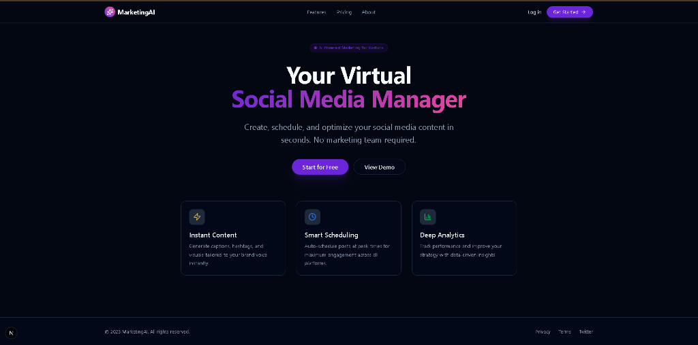
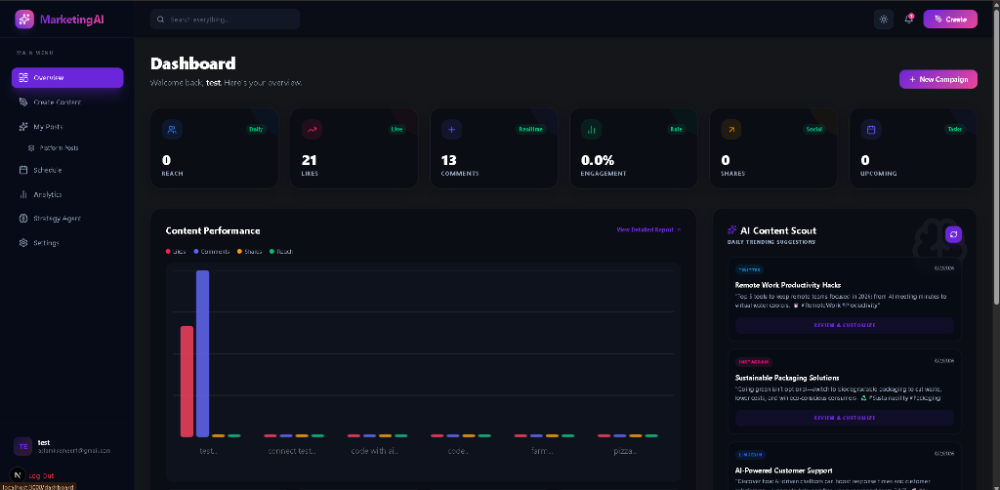
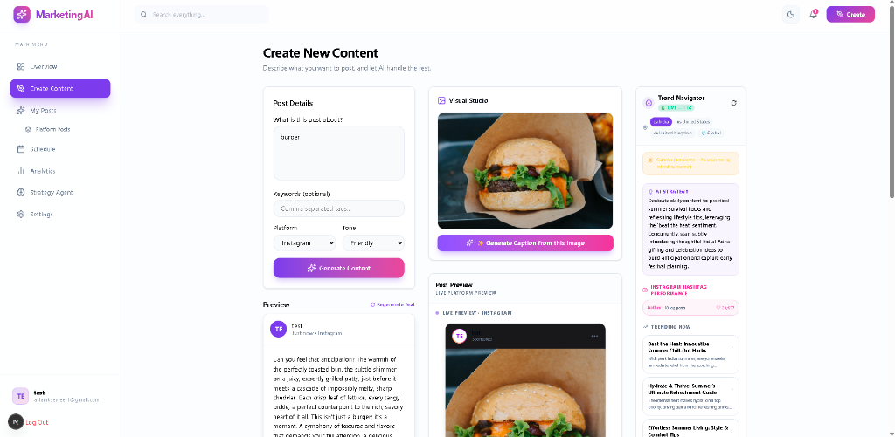
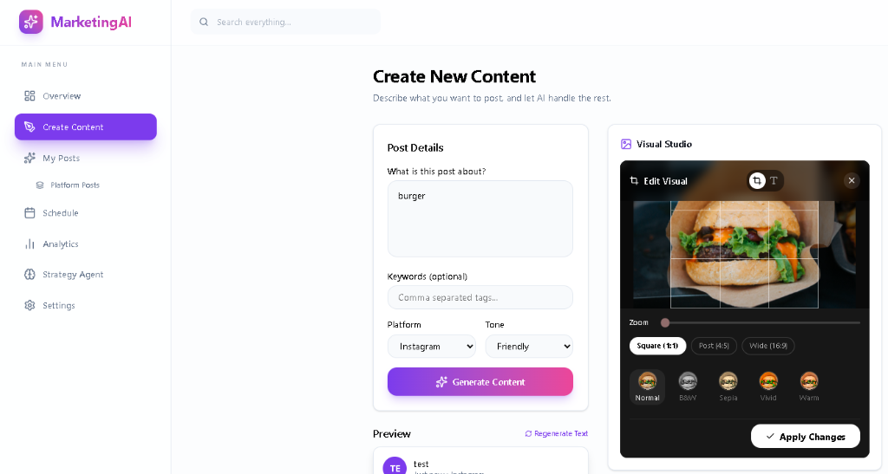
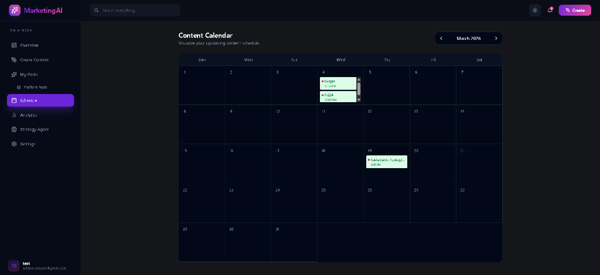

# 🚀 MarketingAI - AI-Powered Social Media Management Suite

MarketingAI is a premium, state-of-the-art Next.js web application designed to help startups, content creators, and marketing teams automate, schedule, and optimize their social media strategy. Driven by Gemini AI models, Firebase backend orchestration, and beautiful animations, the platform acts as your virtual social media manager.

---

## 📸 Project Showcase

### 🎨 Beautiful & Interactive Landing Page
Modern, responsive, and dark-themed hero landing page introducing the application.


---

### 📊 Centralized Analytics Dashboard
Track content performance metrics (Reach, Likes, Comments, and Engagement Rate) in real-time. Includes an **AI Content Scout** for automated trend identification.


---

### ✍️ AI-Powered Content Creation
Generate platform-tailored post descriptions, hashtags, and captions using Gemini AI. Preview how your post will look live on target social networks (e.g. Instagram).


---

### ✂️ Built-in Visual Studio & Image Editor
Edit and crop your uploaded marketing assets to ideal sizes (Square 1:1, Port 4:5, Wide 16:9) and apply filters like Sepia, B&W, and Vivid.


---

### 📅 Interactive Content Calendar
Schedule draft and live posts visually on a clean, responsive calendar grid to schedule publication at peak engagement times.


---

## ✨ Key Features

1. **AI Content Studio**: Enter a prompt or upload an image, and our Gemini Multimodal Integration will auto-generate copy, hashtags, and tags tailored to your selected brand voice.
2. **Visual Studio & Filter Suite**: Edit, rotate, and crop visual assets directly inside the dashboard. Apply beautiful filters to guarantee premium quality assets.
3. **Live Platform Previews**: Real-time mockup overlays matching actual UI layouts (Instagram, LinkedIn, Twitter/X) so you know exactly how posts will look.
4. **Trend Navigator**: Live region-targeted trending topic discovery (India, US, UK, and Global) to ensure your posts align with viral events.
5. **Tone & Quality Guard**: Real-time AI check to ensure posts adhere to brand safety, tone consistency, and spelling rules before going live.
6. **Smart Content Calendar**: Manage, reschedule, and visualize all draft and published content.

---

## 🛠️ Technology Stack

- **Framework**: [Next.js 16 (App Router)](https://nextjs.org)
- **Frontend library**: [React 19](https://react.dev)
- **Styling**: [TailwindCSS v4](https://tailwindcss.com) & [Framer Motion](https://www.framer.com/motion/) (animations)
- **Database & Storage**: [Firebase & Firestore](https://firebase.google.com)
- **Authentication**: [Firebase Auth (Google OAuth)](https://firebase.google.com/docs/auth)
- **AI Integrations**: Google Gemini AI Developer SDK (Multimodal & Text models)
- **Icons**: [Lucide React](https://lucide.dev)

---

## ⚙️ Local Installation & Setup

Follow these steps to run the application locally on your machine:

### 1. Clone the repository
```bash
git clone https://github.com/aslam0246/Marketing-AI.git
cd Marketing-AI
```

### 2. Install dependencies
```bash
npm install
```

### 3. Setup Environment Variables
Create a file named `.env.local` in the root of the project and populate it with your environment config:

```env
# Firebase Configuration
NEXT_PUBLIC_FIREBASE_API_KEY=your_api_key
NEXT_PUBLIC_FIREBASE_AUTH_DOMAIN=your_auth_domain
NEXT_PUBLIC_FIREBASE_PROJECT_ID=your_project_id
NEXT_PUBLIC_FIREBASE_STORAGE_BUCKET=your_storage_bucket
NEXT_PUBLIC_FIREBASE_MESSAGING_SENDER_ID=your_sender_id
NEXT_PUBLIC_FIREBASE_APP_ID=your_app_id

# AI API Keys
GEMINI_API_KEY=your_gemini_api_key
HUGGINGFACE_API_KEY=your_hf_api_key
```

### 4. Run the development server
```bash
npm run dev
```

Open [http://localhost:3000](http://localhost:3000) in your browser to view the application.

---

## 📄 License
This project is licensed under the MIT License.
